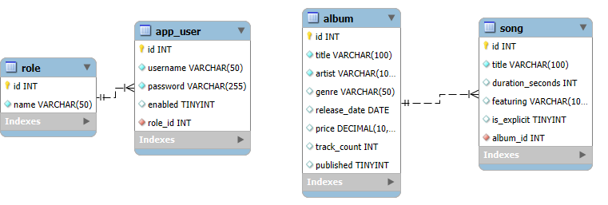
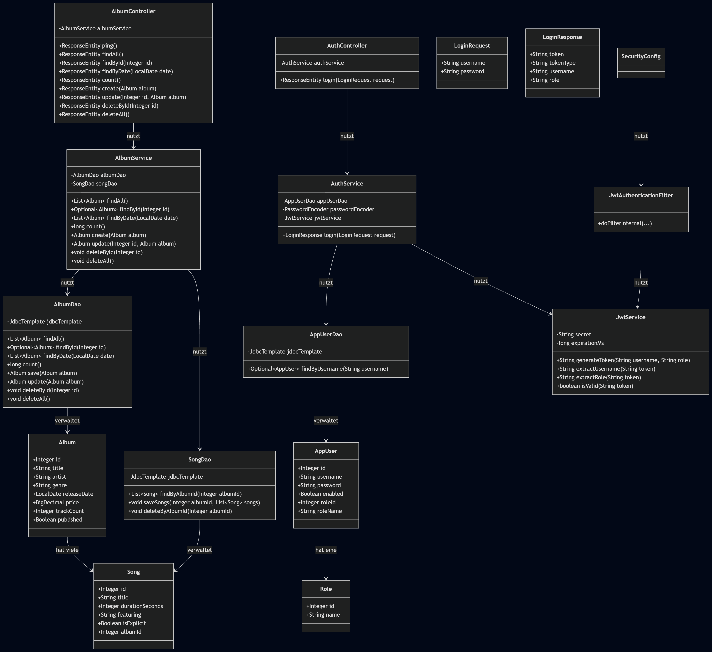
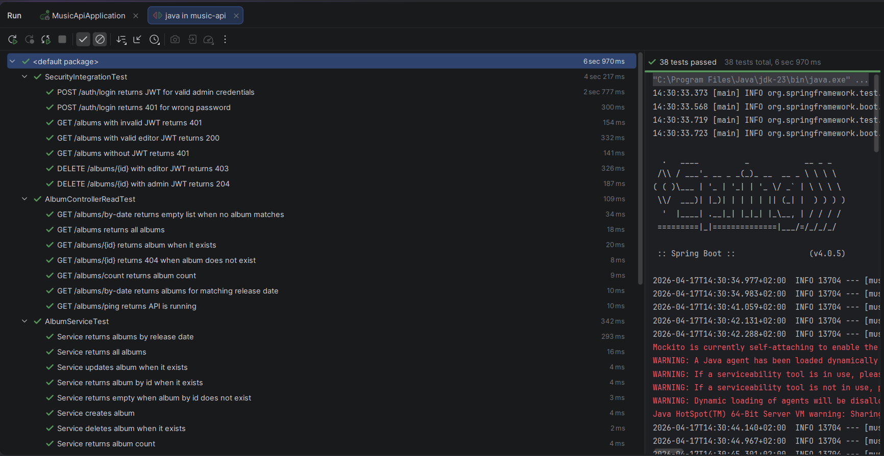
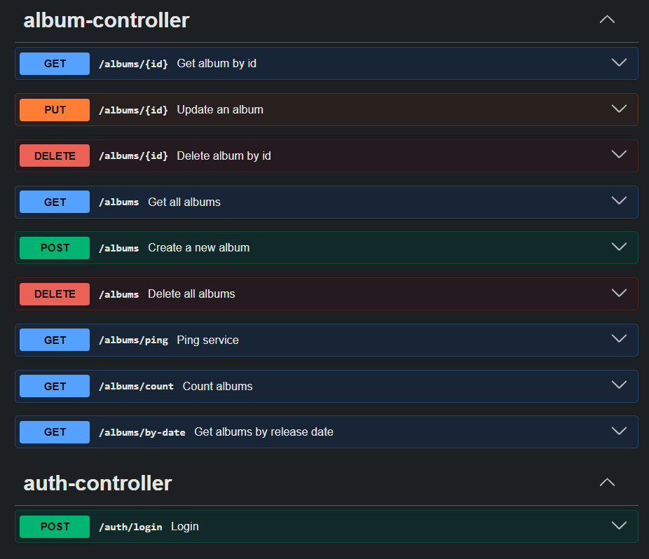

# Music API

## Beschreibung

Diese Anwendung ist eine RESTful API zur Verwaltung von Musikdaten.  
Es können Alben und deren Songs erstellt, gelesen, aktualisiert und gelöscht werden.

Zusätzlich wurde eine Authentifizierung mit JWT implementiert, um geschützte Endpunkte abzusichern.

---

## Technologien

- Java / Spring Boot
- JDBC
- MySQL
- JWT (Authentication)
- Swagger / OpenAPI
- JUnit Tests

---

## Visuals

### ERD



### Klassendiagramm



### Testausführung



Die Testfälle wurden erfolgreich ausgeführt. Alle Tests sind bestanden.

---

## Validierungsregeln

Folgende Validierungen wurden umgesetzt:

- **price (Decimal):**
    - Muss grösser oder gleich 0 sein

- **trackCount (Integer):**
    - Muss mindestens 1 sein

- **releaseDate (Date):**
    - Darf nicht in der Zukunft liegen

---

## Berechtigungsmatrix

Die API verwendet drei Zugriffsstufen:

- **PermitAll**: Kein Login erforderlich
- **ADMIN**: Voller Zugriff auf alle Funktionen
- **EDITOR**: Zugriff auf Lesen und Schreiben, aber keine Löschrechte

### Tabelle

| Endpoint        | Methode | PermitAll | ADMIN | EDITOR |
|-----------------|---------|-----------|-------|--------|
| /auth/login     | POST    | ✔         | ✔     | ✔      |
| /albums/ping    | GET     | ✔         | ✔     | ✔      |
| /albums         | GET     | ✘         | ✔     | ✔      |
| /albums/{id}    | GET     | ✘         | ✔     | ✔      |
| /albums/count   | GET     | ✘         | ✔     | ✔      |
| /albums/by-date | GET     | ✘         | ✔     | ✔      |
| /albums         | POST    | ✘         | ✔     | ✔      |
| /albums/{id}    | PUT     | ✘         | ✔     | ✔      |
| /albums/{id}    | DELETE  | ✘         | ✔     | ✘      |
| /albums         | DELETE  | ✘         | ✔     | ✘      |

### Erklärung

- Benutzer müssen sich über `/auth/login` anmelden und erhalten ein JWT.
- Geschützte Endpunkte können nur mit gültigem Token aufgerufen werden.
- Die Zugriffsrechte werden über die Rolle (`ADMIN`, `EDITOR`) gesteuert.

---

## OpenAPI / Swagger

Die API ist dokumentiert und kann über Swagger getestet werden:

[Swagger UI öffnen](http://localhost:8080/swagger-ui/index.html)

### Swagger UI



Die Swagger UI zeigt alle verfügbaren Endpunkte und ermöglicht das direkte Testen der API.

### Beispiel-Endpunkte

Die wichtigsten Endpunkte der API sind:

- `POST /auth/login` – Benutzer anmelden und JWT erhalten
- `GET /albums` – Alle Alben abrufen
- `GET /albums/{id}` – Einzelnes Album abrufen
- `POST /albums` – Neues Album erstellen
- `PUT /albums/{id}` – Album aktualisieren
- `DELETE /albums/{id}` – Album löschen (nur ADMIN)

Eine vollständige Übersicht aller Endpunkte ist in Swagger verfügbar.

---

## Setup

1. `.env` Datei erstellen mit:

```env
DB_URL=jdbc:mysql://localhost:3306/music_api
DB_USER=root
DB_PASSWORD=your_password
JWT_SECRET=your_secret_key
JWT_EXPIRATION_MS=3600000 
```

Eine Beispielkonfiguration befindet sich in der Datei `.env.example`.

2. Datenbank starten

3. Anwendung starten

4. Swagger öffnen und testen

---

## Codequalität

Der Code wurde mit Spotless formatiert, um einen einheitlichen und sauberen Code-Stil im gesamten Projekt
sicherzustellen.

---

## Autorin

Elena Trogada

---

## Zusammenfassung

In diesem Projekt wurde eine vollständige REST API zur Verwaltung von Musikdaten entwickelt.  
Die Anwendung ermöglicht CRUD-Operationen für Alben und Songs und basiert auf einer relationalen MySQL-Datenbank.

Der Datenzugriff erfolgte über JDBC und eigene DAO-Klassen.
Zusätzlich wurden Validierungsregeln implementiert, um fehlerhafte Eingaben frühzeitig abzufangen.

Ein zentraler Bestandteil war die Implementierung einer JWT-basierten Authentifizierung.  
Benutzer können sich über einen Login anmelden und erhalten ein Token, welches für den Zugriff auf geschützte Endpunkte
erforderlich ist.  
Die Zugriffsrechte werden über Rollen (ADMIN und EDITOR) gesteuert.

Für die Qualitätssicherung wurden automatisierte Tests erstellt, welche sowohl die Funktionalität der API als auch die
Security überprüfen.  

Insgesamt zeigt das Projekt den vollständigen Aufbau einer strukturierten und abgesicherten Backend-Anwendung mit klarer Trennung von Controller-, Service- und Datenzugriffsschicht.
